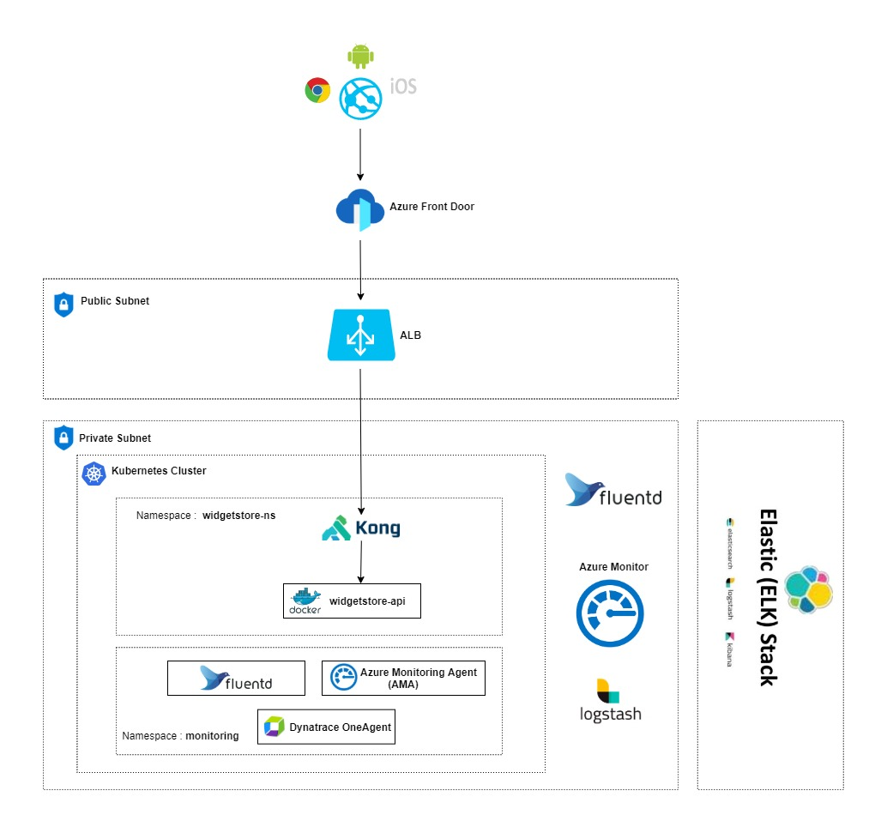

# widgetstore-app

A Widget is an object on a plane in a Cartesian coordinate system that has coordinates (X, Y), Z-index, width, height, last modification date, and a unique identifier.

X, Y, and Z-index are integers (may be negative). Width and height are integers > 0. Widget attributes should be not null.

A Z-index is a unique sequence common to all widgets that determines the order of widgets (regardless of their coordinates). Gaps are allowed. The higher the value, the higher the widget lies on the plane.

A web service to work with widgets via HTTP REST API. The service stores only widgets if all clients work with the same board.

## Software Requirements

* [Java](https://www.oracle.com/java/)
* [Maven](https://maven.apache.org/)
* [Spring Boot](https://spring.io/projects/spring-boot)
* [H2 Database](https://www.h2database.com/html/main.html)
* [jUnit](https://junit.org/)
* [mockito](https://site.mockito.org/)
* [Docker](https://www.docker.com/)

## Application Architecture



## How to run the application

## Running the application using docker

### Installation

Use the maven command line interface [Maven](https://maven.apache.org/) to install the dependencies

```bash
mvn install -DSkipTests
```

### Test
Use the maven command line interface [Maven](https://maven.apache.org/) to perform unit test
```bash
mvn test
```
### package build 
```bash
mvn package
```
### Docker build
```bash
docker build --rm -f "Dockerfile" -t widgetstore:latest "."
```

### How the docker image is build
* Base image for the docker container is `adoptopenjdk:11-jre-openj9`

* lib files from the location  `/target/dependency/lib ` are copied to `/app/lib` in the image

* Resources files from the location  `/target/dependency/resources ` are copied to `/app` in the image

* Compiled class files from the location  `/target/classes ` are copied to `/app` in the image

### How to run docker container

```bash
docker container run  -p 8080:8080 -d --rm --name coffee-shop  widgetstore:latest
```
## How to run the application in Kubernetics

* push the created image to Docker container registry using push command
   `docker tag 092f82fa7ed7 noblesebastiank/widgetstore:latest`
   `docker push noblesebastiank/widgetstore:latest`
* connect to cloud kubernetes cluster
* Deploy the image to kubernetics pod using apply command
 ` kubectl apply -f deployment.yaml`
* Check the status of the pod
 ` Kubectl get pods`
* Test the application

## How to run the application in Azure Cloud

* Create build pipe line using mvn template or default template
* Define stages for using mvn template, add stages like test,pakage,build image,push image to docker container registry
* Create release piple line in cloud and deploy the deployment.yaml 
 ` kubectl apply -f deployment.yaml`
* Check the status of the pod
 ` Kubectl get pods`
* Test the application

## Running the application with IDE

There are several ways to run a Spring Boot application on your local machine. One way is to execute the `main` method in the `com.miro.widgetstore.Application` class from your IDE.

* 	Download the zip or clone the Git repository.
* 	Unzip the zip file (if you downloaded one)
* 	Open Command Prompt and Change directory (cd) to folder containing pom.xml
* 	Open Eclipse
	* File -> Import -> Existing Maven Project -> Navigate to the folder where you unzipped the zip
	* Select the project
* 	Open Intleji
	* File->Open -> Navigate to the folder where you unzipped the zip
	* Select the project
* 	Choose the Spring Boot Application file (search for @SpringBootApplication)
* 	Right Click on the file and Run as Java Application

 

## Health Check

+
    - path : /application/health
    - port : 8080
    
## Data Contract

+ 
    - path : openapi.yaml
    - open [swaggerEditor](https://editor.swagger.io)  then paste the contents in openapi.yaml
    
## Swagger URL
  -  http://localhost:8080/swagger-ui/index.html 
   
## API collection
 - https://www.getpostman.com/collections/34564d25d1d36b92fcab
 
## SAMPLE API collection
   - CREATE WIDGET- POST http://localhost:8080/api/widgets
   - Input-{ "xCoordinate":1, "yCoordinate":1, "zCoordinate":4, "width":209, "height":100 }
   
   - UPDATE WIDGET- UPDATE http://localhost:8080/api/widgets
   - Input- { "id":2, "xCoordinate":2, "yCoordinate":1, "zCoordinate":4, "width":205, "height":100 }
   - GET WIDGET ALL- GET http://localhost:8080/api/widgets?limit=10
         
   - GET WIDGET BY ID- GET http://localhost:8080/api/widgets/1
   - DELETE WIDGET BY ID- DELETE http://localhost:8080/api/widgets/1
        
## Test Coverage
  - 72 % Test coverage, it can be viewed  using Jacoco

